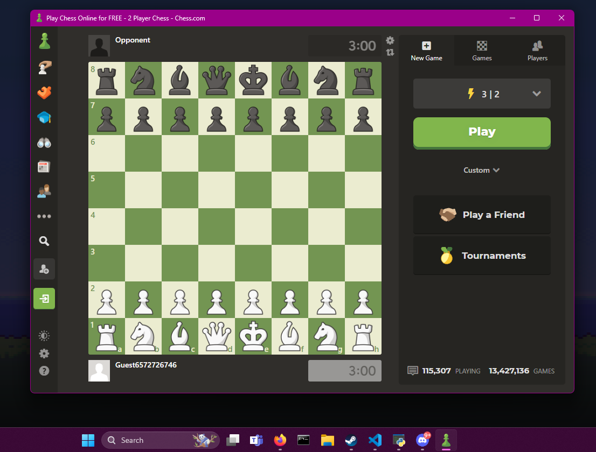

# Chess.com Electron App with adblock



This application is a straightforward Electron-based wrapper for Chess.com, designed to enhance your experience by providing an ad-free browsing environment through an integrated ad blocker.

## Prerequisites

Make sure you have both Node.js and npm (Node Package Manager) installed on your computer before starting. Node.js can be downloaded from https://nodejs.org/, and npm comes bundled with it.

## Installation

To set up the project on your local machine, follow the steps below:

1. **Clone the Repository**
```
git clone <repository-url>
cd <repository-directory>
```

2. **Install Dependencies**
```
npm install
```
This installs all necessary packages, including Electron and the ad blocker.

## Running the Application

Start the application by executing:
```
npm start
```
This command will launch the Electron application and open Chess.com within it.

## Compiling to Executable

To create an executable file for Windows, macOS, or Linux, you'll need a tool like electron-packager or electron-builder. Here's how to use electron-packager:

1. **Install electron-packager Globally**
```
npm install electron-packager -g
```

2. **Compile the Application**

- For Windows:

  ```
  electron-packager . --platform=win32 --arch=x64
  ```

- For macOS:

  ```
  electron-packager . --platform=darwin --arch=x64
  ```

- For Linux:

  ```
  electron-packager . --platform=linux --arch=x64
  ```
